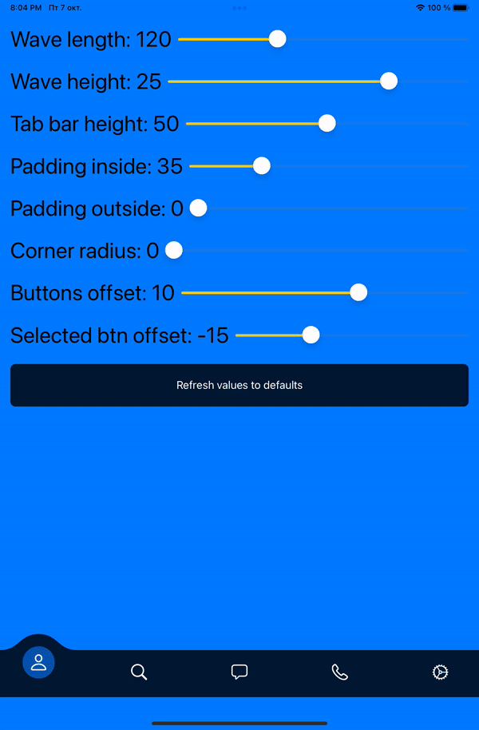
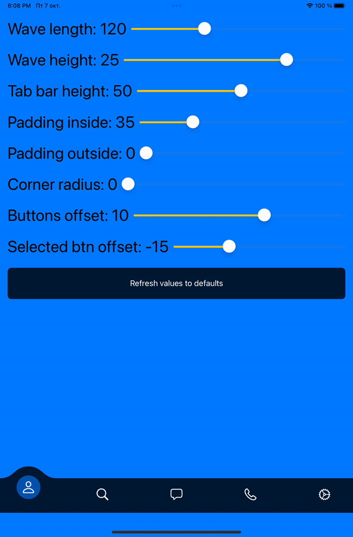

# WavedTabView
Tutorial how tab bar can be customised and animated using SwiftUI

<p align="center">
    
    
    
</p>

👨🏻‍💻 Feel free to subscribe to channel **[SwiftUI dev](https://t.me/swiftui_dev)** in telegram.

If you like this repository, please do :star: to make this useful for others.

## Quick start

- upside-waved variant:
<p align="left">

</p>

- inside-waved variant: 
<p align="left">

</p>

- without wave, classical variant: 
<p align="left">

</p>

## Installation

To install waved tab view attach [WavedTabView.swift](https://github.com/c-villain/WavedTabView/blob/main/WavedTabView.swift) file to your project and call:

```swift
import SwiftUI

@main
struct SUIChallengesApp: App {
    var body: some Scene {
        WindowGroup {
            WavedTabView() // <=== HERE!
        }
    }
}
```
or for example in SceneDelegate: 
```swift
func scene(_ scene: UIScene, willConnectTo session: UISceneSession, options connectionOptions: UIScene.ConnectionOptions) {
        let contentView = WavedTabView() // // <=== HERE!
       
        if let windowScene = scene as? UIWindowScene {
            let window = UIWindow(windowScene: windowScene)
            window.rootViewController = UIHostingController(rootView: contentView)
            self.window = window
            window.makeKeyAndVisible()
        }
    }
```
### Requirements
- iOS 13.0


## Communication

- If you **found a bug**, open an issue or submit a fix via a pull request.
- If you **have a feature request**, open an issue or submit a implementation via a pull request or hit me up on **lexkraev@gmail.com** or **[telegram](https://t.me/lexkraev)**.
- If you **want to contribute**, submit a pull request onto the master branch.
